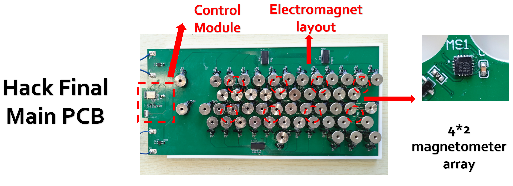

# Hardware Design of DualStrike

## Description

This directory contains the PCB design source files for DualStrike, including the main PCB, a flashing board for programming the MCU (MDBT42Q-512KV2), and a measurement board used for lightweight reverse engineering as described in Sec. IV.A (Fig. 5) of the paper.

## Directory Overview

- The `/Hack_Final` directory contains the main PCB used in the Attack device.
- The `/Flashing_Module` directory contains the flashing board used to program the MCU, enabling all possible functions of DualStrike.
- The `/Mesurement_Module` directory contains a PCB with the MLX90393 sensor, which can be used as a replacement for the original linear Hall effect sensor on Hall effect keyboards for measurement purposes.

## Hardware requirements

We utilize Altium to design PCB boards. After the PCB is manufactured, we also provide an interactive HTML BOM file to facilitate the quick installation of components. Please refer to the BOM.html file.

