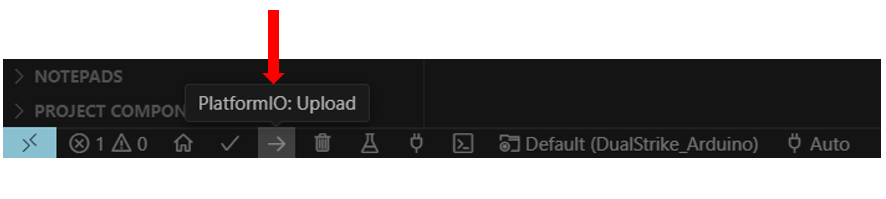

# Firmware Design of DualStrike

## Description

This directory contains the firmware design for DualStrike.

- **ReadSensor_Wired_Arduino**:  
  This code transmits data from the magnetometer array in packages at a 1MHz sampling rate. It is used for eavesdropping to collect keystroke data from the magnetometer array for training purposes.  
  - This code works together with `3.Software/serial_collect_training.py` to receive and store data on the Python side, which is then classified using `3.Software/classify.py` to obtain the eavesdropping MLP model parameters.
  - It can also be used with `3.Software/serial_collect_calibration.py` for offline analysis of calibration data.

- **DualStrike_Arduino**:  
  This is a standalone firmware that can be independently flashed to the MCU to enable all real-time functional features of DualStrike. For details, please refer to `2.Firmware/DualStrike_Arduino/README.md`.

## How to Flash the Firmware

The Arduino code uses the PlatformIO framework, which can be installed as an extension in common IDEs such as Visual Studio Code.  
To flash the firmware, connect the `1.Hardawre/Flashing_Module` to the main PCB, then click the `PlatformIO: Upload` button at the bottom of the IDE.

