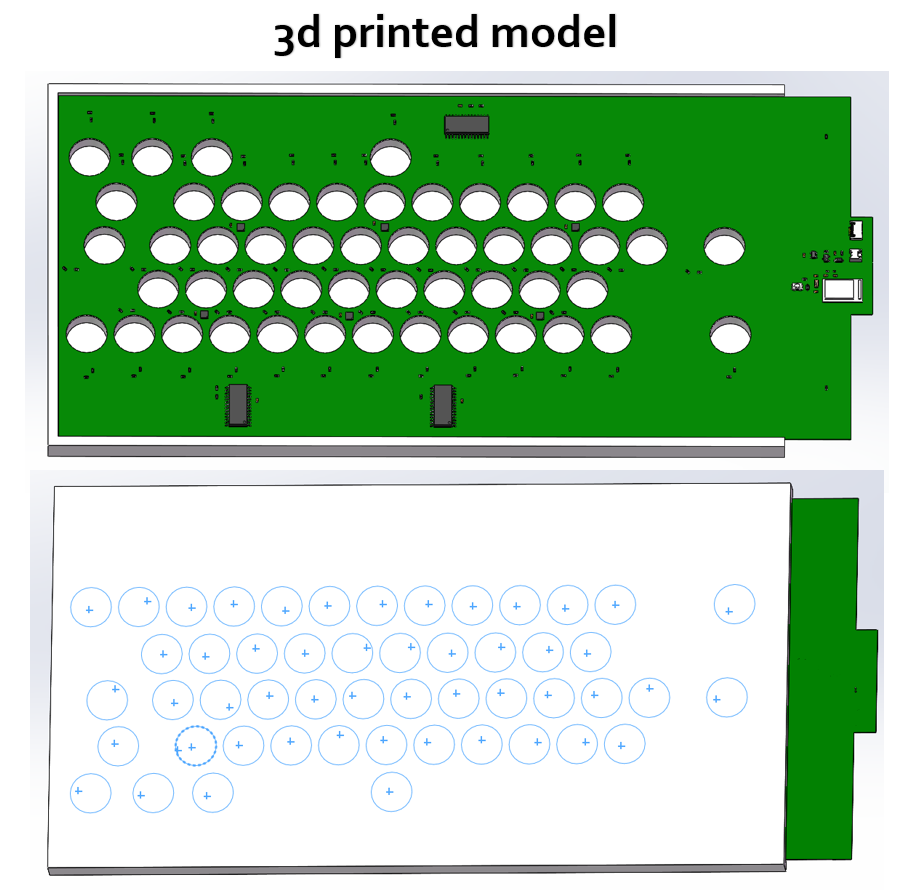

# 3D Model Design of DualStrike

## Description

This directory contains the 3D-printed model designs for DualStrike.

- `Hack_Final.step`: The 3D model of the main PCB, corresponding to the hardware section.
- `Hack_Base.SLDPRT`: The 3D model that needs to be printed using TPU material. This part is used during assembly to hold the PCB and electromagnets, ensuring that all attack electromagnets are positioned at the same height.

