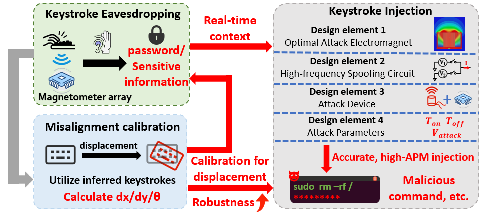
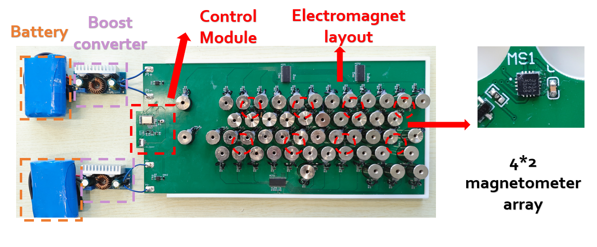

# About

This repository contains all software and hardware implementations of DualStrike

## Overview

1. We designed a universal attack device for Hall-effect keyboards, which can simultaneously leverage a magnetometer array for keystroke inference (eavesdropping) and an electromagnet array for per-key keystroke injection on Hall-effect keyboards.
2. We propose a novel, unified attack framework that combines both eavesdropping and keystroke injection in a single system. By incorporating a calibration mechanism, DualStrike significantly enhances robustness, enabling reliable attacks even under real-world disturbances such as keyboard displacement.

## Project Structure

- **[1.Hardware](1.Hardawre/README.md):** Source files for building the PCB of the DualStrike attack device.
- **[2.Firmware](2.Firmware/README.md):** Arduino code (PlatformIO framework) to run all DualStrike functions—keystroke injection, eavesdropping, and calibration—in real time and locally on the MCU control module.
- **[3.Software](3.Software/README.md):** Python code for collecting training data for the MLP model in the eavesdropping pipeline (Sec. V.A), and for offline data analysis supporting both eavesdropping and calibration.
- **[4.3D model](4.3D_model/README.md):** 3D design files for the DualStrike base.

## Setup

To build and validate DualStrike, the following steps are required:

- [Fabricate the hardware](#fabricate-the-hardware)
- [Assemble the attack device](#assemble-the-attack-device)
- [Set up the experiment environment](#set-up-the-experiment-environment)
- [Program the device](#program-the-device)
- [Run the DualStrike pipeline](#run-the-dualstrike-pipeline)

### Fabricate the Hardware

We provide the hardware requirements and manufacturing details for the DualStrike PCB and 3D-printed model in [1.Hardware](1.Hardawre/README.md) and [4.3D model](4.3D_model/README.md). Users need to prepare and manufacture the main attack PCB and 3D-printed model in advance.

### Assemble the Attack Device

Solder the electromagnets onto the main PCB, assemble it with the 3D-printed case, and solder the battery and boost converter to complete the attack device.

### Set Up the Experiment Environment

As shown in Fig. 17, place the 3D-printed case on the base and position the prepared Hall-effect keyboard on top. The Hall-effect keyboard is connected via the user device.

### Program the Device

We use the PlatformIO framework to program the main PCB of the attack device according to the hardware specifications.

1. **PlatformIO Setup:**  
   PlatformIO can be installed as an extension in common IDEs such as Visual Studio Code. For our prototype, we use Version 3.3.4.

2. **Flashing:**  
   Set up the flashing module and the main PCB, then connect to your PC.  
   Once connected, click the `PlatformIO: Upload` button at the bottom of the IDE to flash the firmware.

You can choose to flash the `ReadSensor_Wired_Arduino` code to transmit raw magnetometer array data via serial port for offline processing and analysis with the Python implementation (`3.Software`).  
Alternatively, you can flash `2.Firmware/DualStrike_Arduino`, which can run independently on the MCU to enable all real-time functional features of DualStrike.

### Run the DualStrike Pipeline

After flashing, you can test DualStrike in two ways:

- **Python Implementation:**  
  Use Python scripts for offline processing and visualization of eavesdropping and calibration data.  
  For detailed workflow, see [3.Software/README.md](3.Software/README.md).

- **Arduino Implementation:**  
  Implements all functional features of DualStrike, running in real-time and locally on the MCU.  
  For details on operation modes and experiments, see [2.Firmware/DualStrike_Arduino/README.md](2.Firmware/DualStrike_Arduino/README.md).
