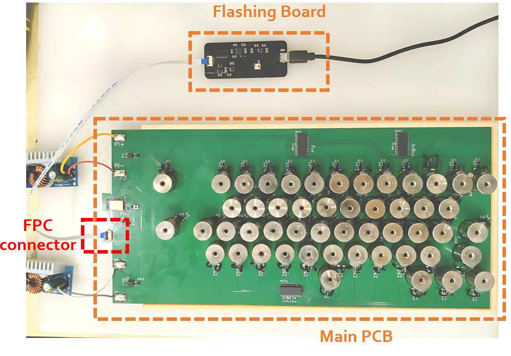
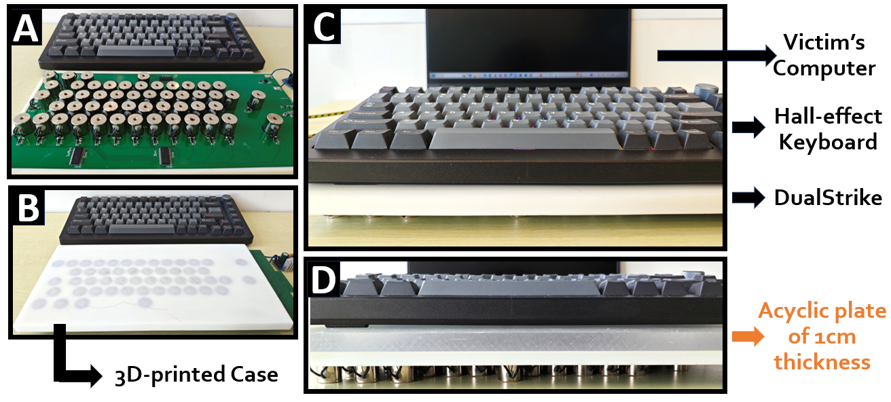

# The source code of the artifact submission for DualStrike in NDSS'26 Summer

This repository contains all software and hardware implementations of DualStrike.

## Overview

This artifact provides a complete framework for develop-
ing DualStrike, a new attack module that can perform
both real-time keyboard listening and non-invasive, per-key
keystroke injection on Hall-effect keyboards, while also in-
corporating a calibration mechanism to mitigate real world
disruptions such as keyboard displacements

1. We designed a universal attack device for Hall-effect keyboards, which can simultaneously leverage a magnetometer array for keystroke inference (eavesdropping) and an electromagnet array for per-key keystroke injection on Hall-effect keyboards.
2. We propose a novel, unified attack framework that combines both eavesdropping and keystroke injection in a single system. By incorporating a calibration mechanism, DualStrike significantly enhances robustness, enabling reliable attacks even under real-world disturbances such as keyboard displacement.
The demo video of DualStrike can be found in the link: https://sites.google.com/view/magkey-anonymous?usp=sharing

## Project Structure

- **[1.Hardware](1.Hardawre/README.md):** Source files for building the PCB of the DualStrike attack device.
- **[2.Firmware](2.Firmware/README.md):** Arduino code (PlatformIO framework) to run all DualStrike functions—keystroke injection, eavesdropping, and calibration—in real time and locally on the MCU control module.
- **[3.Software](3.Software/README.md):** Python code for collecting training data for the MLP model in the eavesdropping pipeline (Sec. V.A), and for offline data analysis supporting both eavesdropping and calibration.
- **[4.3D model](4.3D_model/README.md):** 3D design files for the DualStrike base.

## Setup

To build and validate DualStrike, the following steps are required:

- [Fabricate the hardware](#fabricate-the-hardware)
- [Assemble the attack device](#assemble-the-attack-device)
- [Program the device](#program-the-device)
- [Set up the experiment environment](#set-up-the-experiment-environment)
- [Run the DualStrike pipeline](#run-the-dualstrike-pipeline)

### Fabricate the Hardware

We provide the hardware requirements and manufacturing details for the DualStrike PCB and 3D-printed model in [1.Hardware](1.Hardawre/README.md) and [4.3D model](4.3D_model/README.md). Users need to prepare and manufacture the main attack PCB and 3D-printed model in advance.

### Assemble the Attack Device

Solder the electromagnets onto the main PCB, assemble it with the 3D-printed case, and solder the battery and boost converter to complete the attack device.

### Program the Device

We use the PlatformIO framework to program the main PCB of the attack device according to the hardware specifications.

1. **PlatformIO Setup:**  
   PlatformIO can be installed as an extension in common IDEs such as Visual Studio Code. For our prototype, we use Version 3.3.4.

2. **Flashing:**  
   Connect the Main PCB and the flashing board as shown in the figure below. The flashing board is connected to the Main PCB via an FPC line and the FPC connector on the Main PCB. Then, connect the flashing board to your computer via USB first.

   

   Once connected, click the `PlatformIO: Upload` button at the bottom of the IDE to flash the firmware.

You can choose to flash the `ReadSensor_Wired_Arduino` code to transmit raw magnetometer array data via serial port for offline processing and analysis with the Python implementation (`3.Software`).  
Alternatively, you can flash `2.Firmware/DualStrike_Arduino`, which can run independently on the MCU to enable all real-time functional features of DualStrike.

### Set Up the Experiment Environment

As shown in the figure below:

a. Prepare the attack device, the 3D-printed base, and the Hall-effect keyboard.
b. Invert the attack device so that the main PCB rests on the table with the 3D-printed base facing upward.
c. Place the Hall-effect keyboard on the base.

### Run the DualStrike Pipeline

After flashing, you can test DualStrike in two ways:

- **Python Implementation:**  
  Use Python scripts for offline processing and visualization of eavesdropping and calibration data.  
  For detailed workflow, see [3.Software/README.md](3.Software/README.md).

- **Arduino Implementation:**  
  Implements all functional features of DualStrike, running in real-time and locally on the MCU.  
  For details on operation modes and experiments, see [2.Firmware/DualStrike_Arduino/README.md](2.Firmware/DualStrike_Arduino/README.md).
